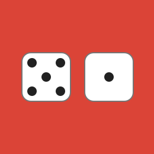
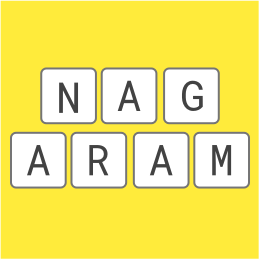
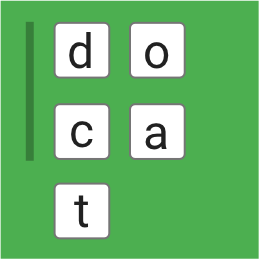
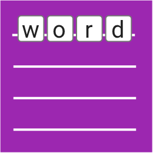
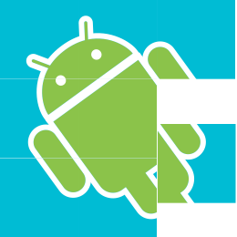
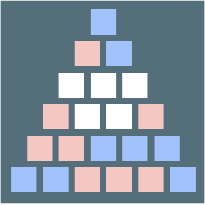
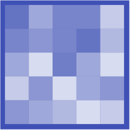
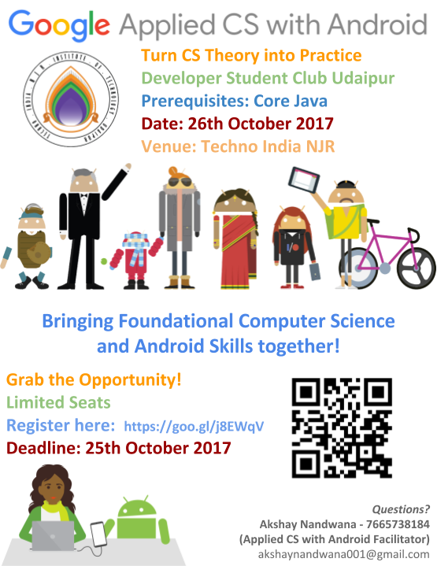
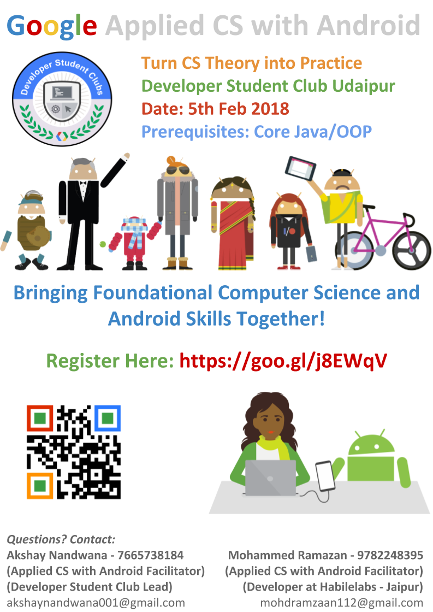

# Applied CS with Android Beginner Workshop

 

### Build Android games.
### Learn computer science.
Applied CS is a free online course by Google designed to prepare you for your CS career through hands on coding experience.

##### PREREQUISITES
- A university-level data structures and algorithms class
- Basic familiarity with Java (syntax and built-in libraries)
- No prior Android experience is needed.

##### REQUIRED MATERIALS
- A computer (with Android Studio installed)
- A Gmail account
- You can run code on Android Studio Emulator or your own mobile device running Gingerbread or higher.

 

     

     

  

